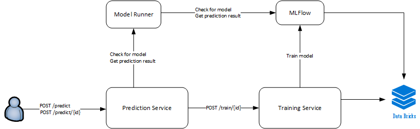

# Serving On-Demand Machine Learning Models with MLflow

[](https://dev.azure.com/csedevil/short-lived-mlflow/_build/latest?definitionId=131&branchName=master)

A solution for on-demand training and serving of Machine Learning models, using [Azure Databricks](https://docs.azuredatabricks.net/getting-started/index.html) and [MLflow](https://docs.azuredatabricks.net/applications/mlflow/index.html).

Most docs and samples out there usually show you how to take one specific ML model and bring it into a production like environment with scale in mind.
In this sample solution, we try to offer an approach to scale the number of different models existing in the system at the same time rather than scaling one specific model for the number of inference requests it is going to answer.
It has been generalized from a real use-case where end-users` actions required models to be trained on the fly and then used for inference at low-scale according to their specifications.

The code in this repository allows a data scientist, that created an MLflow project, to test it with different parameters and later serve the model to get its prediction results based on the trained model.

> When running this sample, we assume a notebook is already loaded in Azure Databricks, and this notebook is using MLflow to store and log the experiments. In this repository there're 2 [sample notebooks](./notebooks) (based on the samples provided by MLflow) you can use to get started.

## Architecture

The solution consists of 3 services deployed on an [Azure Kubernetes Service](https://azure.microsoft.com/en-in/services/kubernetes-service/). In this sample, the services communicate over REST APIs.



**[Prediction Service](prediction/README.md)** is the entry point to the solution, navigating between issuing a train model request and running a model to receive the prediction results.

**[Training Service](training/README.md)** manages the requests to Databricks - starting a cluster and running a notebook to train an ML Model.

**[Model Runner](model-runner/README.md)** serves an MLflow model to return prediction request results.

### Solution User Flow

The entry point to the solution is the Prediction Service, with the /predict POST API.
Detailed user flow with samples and diagram can be found in the [User Flow](./UserFlow.md) article.

We've prepared a few sample API requests to run in postman, using the [sample notebooks](./notebooks) in this repository.

[](https://app.getpostman.com/run-collection/adc8703fb97388e41ded)

> Make sure to replace the address in the request from http://localhost:3000 to the one you used when installing the Prediction Service.

## Deployment

The application is deployed to a Kubernetes cluster using [Helm](https://helm.sh/docs/).

### Pre-requisites

In order to deploy the services to Kubernetes, please make sure the following components are installed and running:

-   Databricks cluster with a notebook for each model required to be trained
-   MLflow available as a service in Databricks
-   Kubernetes cluster and Helm configured and ready for use
-   Docker images registry - you can use any registry. We are using [Azure Container Registry](https://docs.microsoft.com/en-us/azure/container-registry/)

### Build and Publish Docker Images

Build the images using the docker files found in each service folder. The images need to be pushed to a docker registry to be later used to deploy into the k8s cluster.
Note that it is expected that service folder name is used as the service repository name. Make sure to use the same tag for all images.
Use the [build_and_push.sh](build_and_push.sh) script to build, tag and push the images to the registry:

```bash
sh ./build_and_push.sh -t <TAG> -r <REGISTRY>
```

### Configuration

Edit the [values.yaml](deployments\values.yaml) file with the values of the parameters.

-   **replicas**: The number of needed instances of each service.
-   **repository**: Docker images registry that includes the tagged images uploaded and ready to be deployed to k8s cluster.
-   **imagesTag**: The needed tag of the images to be deployed.

> For more information about each service parameters, please refer to the service readme file

#### Models configuration

Under the **modelRunner** section in the `values.yaml` file, you can add, remove or modify the configurations of MLflow models.

To Add a new MLflow model, add a new member to the **MLFlowModels** list, and include the **MODEL_NAME** and **EXPERIMENT_ID** values:

```yaml
MLFlowModels:
    1:
        MODEL_NAME: wine
        EXPERIMENT_ID: <MLFLOW_EXPERIMENT_ID>
    2:
        MODEL_NAME: diabetes
        EXPERIMENT_ID: <MLFLOW_EXPERIMENT_ID>
    3:
        MODEL_NAME: new_model
        EXPERIMENT_ID: <MLFLOW_EXPERIMENT_ID>**
```

Each model has a notebook in Databricks. The paths of these notebooks must be set under the **training** section in the `values.yaml` file. When adding, removing or editing the notebook path in Databricks, you need to make the corresponding change in the **DATABRICKS_TYPE_MAPPING** json:

```yaml
DATABRICKS_TYPE_MAPPING: '{"wine": "/shared/wine_notebook", "diabetes": "/shared/diabetes_notebook", "new_model": "/shared/new_model_notebook"}'
```

### Deploy using Helm

After setting the values in the `values.yaml` file:

-   Open the command line
-   Change directory (cd) to the [deployments](./deployments) directory
-   Run the following command:

    ```bash
    helm install OnDemandMLflowTrainAndServe -f OnDemandMLflowTrainAndServe\values.yaml --name=demo
    ```

This will deploy the services into the Kubernetes cluster.

Please note that the Prediction service is the entry point of this application, so it is set to type `LoadBalancer`, and this will grant it a public IP address.

#### Updating the application in Kubernetes

If there is a need to make changes to any of the values in the `values.yaml`, make the changes and run the following command:

```bash
helm upgrade demo OnDemandMLflowTrainAndServe --recreate-pods --reset-values --force --values OnDemandMLflowTrainAndServe\values.yaml
```

You can also set the values that you need to change inline, by adding `--set var1=value1,var2=value2` at the end of the command.

> Detailed information about Helm commands can be found in [Helm documentation](https://helm.sh/docs/helm/#helm-install).

## Troubleshooting

If something doesn't work for you, see our [troubleshooting guide](Troubleshooting.md)

## Contributing

This project welcomes contributions and suggestions. Most contributions require you to agree to a
Contributor License Agreement (CLA) declaring that you have the right to, and actually do, grant us
the rights to use your contribution. For details, visit https://cla.microsoft.com.

When you submit a pull request, a CLA-bot will automatically determine whether you need to provide
a CLA and decorate the PR appropriately (e.g., label, comment). Simply follow the instructions
provided by the bot. You will only need to do this once across all repos using our CLA.

This project has adopted the [Microsoft Open Source Code of Conduct](https://opensource.microsoft.com/codeofconduct/).
For more information see the [Code of Conduct FAQ](https://opensource.microsoft.com/codeofconduct/faq/) or
contact [opencode@microsoft.com](mailto:opencode@microsoft.com) with any additional questions or comments.
