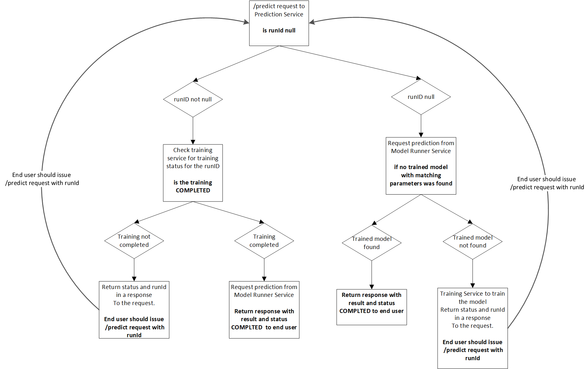

# Solution User Flow

The entry point to the solution is the Prediction Service, with the **/predict** POST API.
The body of the request includes the required parameters to run an ML Model.

The diagram bellow illustrates the processes and decisions taken throughout the solution life cycle:


User requests a prediction based on an ML Model stored in databricks by using the /predict API:

1. If a model with the same parameters as in the request parameters is already available in MLflow experiments, the Model Runner serves the model and will return the result
2. If the model is not available for the requested parameters:
    1. Prediction service issues a request to the Training Service to train the model.
    2. Training model returns a **run id**, used to identify the request
    3. User issues a new /predict request, specifying the **run id** in timely intervals, until a response with status **COMPLETED** is returned. This response will hold the result of the model execution.

## API body structure sample

```json
{
    "runId": null,
    "modelType": "WINE",
    "modelParameters": {
        "alpha": 0.36,
        "l1_ratio": "0.33"
    },
    "predictionParameters": {
        "alcohol": 12.8,
        "chlorides": 0.029,
        "citric_acid": 0.48,
        "density": 0.98,
        "fixed_acidity": 6.2,
        "free_sulfur_dioxide": 29,
        "pH": 3.33,
        "residual_sugar": 1.2,
        "sulphates": 0.39,
        "total_sulfur_dioxide": 75,
        "volatile_acidity": 0.66
    }
}
```

We've prepared a few sample API requests to run in postman, using the [sample notebooks](./notebooks) in this repository.

[](https://app.getpostman.com/run-collection/adc8703fb97388e41ded)

> Make sure to replace the address in the request from http://localhost:3000 to the one you used when installing the Prediction Service.
